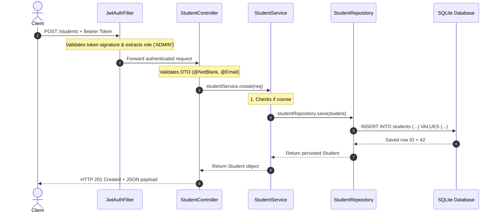

# Beginner's Guide to Spring Boot: Understanding Your Course Enrollment Project

Welcome to Spring Boot! If this is your first Spring Boot project, it might feel like there is a lot of "magic" happening under the hood—annotations everywhere, classes talking to each other without explicit `new` keywords, and database queries executing without writing SQL.

This guide will demystify all of that. We'll break down **what Spring Boot is**, **how it works**, and **walk through every piece of this project step-by-step** using real code from your repository.

---

## Table of Contents

1. [What is Spring Boot & Why Do We Use It?](#1-what-is-spring-boot--why-do-we-use-it)
   - [The Problem with Plain Java](#the-problem-with-plain-java)
   - [Core Concepts: IoC, DI, and Beans](#core-concepts-ioc-di-and-beans)
2. [What Does This Project Do?](#2-what-does-this-project-do)
   - [Business Domain: Course Enrollment](#business-domain-course-enrollment)
   - [High-Level Architecture](#high-level-architecture)
3. [The Anatomy of Your Spring Boot Project](#3-the-anatomy-of-your-spring-boot-project)
   - [Where It All Begins: `@SpringBootApplication`](#where-it-all-begins-springbootapplication)
   - [Maven & `pom.xml`: Managing Dependencies](#maven--pomxml-managing-dependencies)
   - [Configuration: `application.yml`](#configuration-applicationyml)
4. [The 3-Layer Architecture Pattern](#4-the-3-layer-architecture-pattern)
   - [Layer 1: The Controller Layer (Handling Requests)](#layer-1-the-controller-layer-handling-requests)
   - [Layer 2: The Service Layer (Business Logic)](#layer-2-the-service-layer-business-logic)
   - [Layer 3: The Repository Layer (Database Access)](#layer-3-the-repository-layer-database-access)
   - [Data Models: Entities vs DTOs](#data-models-entities-vs-dtos)
5. [The Life of an HTTP Request (Step-by-Step Walkthrough)](#5-the-life-of-an-http-request-step-by-step-walkthrough)
   - [Tracing `POST /students` (Enrolling a Student)](#tracing-post-students-enrolling-a-student)
6. [Spring Boot Annotations Cheat Sheet](#6-spring-boot-annotations-cheat-sheet)
7. [Security & Authentication Explained](#7-security--authentication-explained)
   - [The Filter Chain Analogy](#the-filter-chain-analogy)
   - [What is a JWT (JSON Web Token)?](#what-is-a-jwt-json-web-token)
   - [Role-Based Access Control (`ADMIN` vs `STUDENT`)](#role-based-access-control-admin-vs-student)
8. [Database & JPA (No SQL Required!)](#8-database--jpa-no-sql-required)
   - [What is an ORM (Hibernate)?](#what-is-an-orm-hibernate)
   - [Spring Data JPA Magic](#spring-data-jpa-magic)
   - [Why SQLite with HikariCP?](#why-sqlite-with-hikaricp)
9. [Error Handling: The Safety Net](#9-error-handling-the-safety-net)
10. [How to Run, Test, and Explore the Project](#10-how-to-run-test-and-explore-the-project)

---

## 1. What is Spring Boot & Why Do We Use It?

### The Problem with Plain Java
In a traditional Java web application, you would need to:
1. Manually configure an external web server like Apache Tomcat.
2. Manually write JDBC code with raw SQL strings (`SELECT * FROM courses...`).
3. Manually create every object using `new CourseService(new CourseRepository())`.
4. Manually parse JSON strings into Java objects and handle errors.

**Spring Boot** solves this by providing:
- **Embedded Web Server:** Tomcat is packaged inside your app. You just run `main()` and your server starts on port `3000`.
- **Auto-Configuration:** Spring Boot inspects the libraries on your classpath (like SQLite and Hibernate) and automatically wires up database connections, JSON parsers, and web servers.
- **Dependency Injection:** You declare *what* your classes need, and Spring automatically creates and supplies those dependencies.

---

### Core Concepts: IoC, DI, and Beans

You will hear three terms constantly in the Spring world:

#### 1. Bean
A **Bean** is simply a Java object that is instantiated, assembled, and managed by Spring's container rather than by you with `new MyObject()`.

#### 2. Inversion of Control (IoC)
Normally, your code is in control:
```java
// Traditional Java: YOU control object creation
CourseRepository repo = new CourseRepository();
CourseService service = new CourseService(repo);
```
With Spring, control is **inverted**: Spring creates the objects at startup and holds them in an "Application Context" (a big catalog of beans).

#### 3. Dependency Injection (DI)
When a class needs another class, Spring "injects" it automatically. For example, look at [CourseController.java](file:///Users/manjesh/Desktop/Course/course-enrollment/src/main/java/com/courseenrollment/course/controller/CourseController.java):

```java
@RestController
@RequestMapping("/courses")
public class CourseController {

    private final CourseService courseService;

    // Spring sees this constructor, looks up the CourseService bean,
    // and automatically passes it in!
    public CourseController(CourseService courseService) {
        this.courseService = courseService;
    }
}
```
You never write `new CourseService()` anywhere. Spring handles it.

---

## 2. What Does This Project Do?

### Business Domain: Course Enrollment & Approval System
This project is a university course enrollment backend system featuring a **3-role hierarchy** and a **course approval workflow**:
- **Roles:**
  - **`ADMIN`:** Full control. Can create/edit/delete any course, approve or reject instructor courses, manage all students, and manually adjust capacities.
  - **`INSTRUCTOR`:** Can submit new courses (created in `PENDING` status awaiting admin review), manage and edit their own courses, and view student rosters.
  - **`STUDENT`:** Can browse all `APPROVED` courses, self-enroll in available courses (`POST /courses/{id}/enroll`), and view their enrolled courses ("My Courses").
- **Course Approval Workflow:**
  - `PENDING`: Newly proposed courses by instructors. Only visible to the instructor and administrators.
  - `APPROVED`: Reviewed and approved by an admin. Publicly visible in the course catalog and open for student enrollment.
  - `REJECTED`: Rejected by an admin with course creation barred from enrollment.
- **Capacity Rules:**
  - A student cannot enroll in a course that is full (`409 Conflict`).
  - A student cannot enroll in a course that is not approved (`409 Conflict`).
  - An administrator or instructor cannot reduce a course's seat limit below the number of students already enrolled (`409 Conflict`).
  - A student cannot be transferred to a full or unapproved course (`409 Conflict`).
  - Student emails must be unique across the platform.

---

### High-Level Architecture

```
┌────────────────────────────────────────────────────────┐
│                   React Frontend                       │
│              (Runs on http://localhost:5173)           │
└───────────────────────────┬────────────────────────────┘
                            │ HTTP JSON Requests
                            │ (e.g. GET /courses, POST /students)
                            ▼
┌────────────────────────────────────────────────────────┐
│               Spring Boot Backend (Port 3000)          │
│                                                        │
│  [1. JwtAuthFilter]  ──► Validates JWT Bearer Token    │
│            │                                           │
│            ▼                                           │
│  [2. Controllers]    ──► Listens to HTTP routes        │
│            │             (CourseController, etc.)      │
│            ▼                                           │
│  [3. Services]       ──► Enforces business logic       │
│            │             (Seat capacity, uniqueness)   │
│            ▼                                           │
│  [4. Repositories]   ──► Talks to database with JPA    │
│            │             (CourseRepository, etc.)      │
└────────────┼───────────────────────────────────────────┘
             │ Reads / Writes SQLite file
             ▼
┌────────────────────────────────────────────────────────┐
│              database.sqlite (Disk Storage)            │
└────────────────────────────────────────────────────────┘
```

---

## 3. The Anatomy of Your Spring Boot Project

### Where It All Begins: `@SpringBootApplication`

Open [CourseEnrollmentApplication.java](file:///Users/manjesh/Desktop/Course/course-enrollment/src/main/java/com/courseenrollment/CourseEnrollmentApplication.java):

```java
package com.courseenrollment;

import org.springframework.boot.SpringApplication;
import org.springframework.boot.autoconfigure.SpringBootApplication;

@SpringBootApplication
public class CourseEnrollmentApplication {

    public static void main(String[] args) {
        SpringApplication.run(CourseEnrollmentApplication.class, args);
    }
}
```

This tiny file is the entire entry point of your application!
When you execute `main()`:
1. **Component Scanning:** Spring scans all packages under `com.courseenrollment` looking for classes annotated with `@RestController`, `@Service`, `@Repository`, `@Component`, or `@Configuration`.
2. **Bean Creation:** Spring instantiates those classes and injects their dependencies.
3. **Embedded Tomcat Startup:** An embedded Tomcat HTTP web server starts up on port `3000`.
4. **Database Connection:** Spring connects to `database.sqlite` and prepares Hibernate.

---

### Maven & `pom.xml`: Managing Dependencies

Open [pom.xml](file:///Users/manjesh/Desktop/Course/course-enrollment/pom.xml). Maven is the build tool and package manager for Java (similar to `package.json` in Node.js).

Key "starter" dependencies included:
- `spring-boot-starter-web`: Brings in Tomcat, Spring MVC, and Jackson (JSON serializer).
- `spring-boot-starter-data-jpa`: Brings in Hibernate and Spring Data for easy database operations.
- `spring-boot-starter-security`: Provides authentication and role-based authorization.
- `spring-boot-starter-validation`: Provides annotations like `@NotBlank`, `@Email`, and `@Min`.
- `sqlite-jdbc` & `hibernate-community-dialects`: Allows Hibernate to talk to local SQLite files.
- `jjwt-api`: Generates and verifies HMAC-SHA256 JWT tokens.
- `springdoc-openapi-starter-webmvc-ui`: Automatically generates interactive Swagger documentation at `/docs`.

---

### Configuration: `application.yml`

Located at [application.yml](file:///Users/manjesh/Desktop/Course/course-enrollment/src/main/resources/application.yml):

```yaml
server:
  port: ${PORT:3000}       # Run on port 3000 (or $PORT environment variable)

spring:
  datasource:
    url: jdbc:sqlite:database.sqlite    # Store data in database.sqlite file
    driver-class-name: org.sqlite.JDBC
    hikari:
      maximum-pool-size: 1             # SQLite writes sequentially
  jpa:
    hibernate:
      ddl-auto: update                 # Automatically create/update database tables
    properties:
      hibernate:
        connection:
          foreign_keys: true           # Enforce SQLite foreign keys
```

---

## 4. The 3-Layer Architecture Pattern

In enterprise Spring applications, code is organized into **three distinct layers**. Each layer has one job:

```
[ HTTP Request ] 
       │
       ▼
 1. Controller Layer  ── "What is being requested?" (Routes & JSON validation)
       │
       ▼
 2. Service Layer     ── "Are the rules satisfied?" (Business logic & calculations)
       │
       ▼
 3. Repository Layer  ── "Store or retrieve the data" (Database queries)
       │
       ▼
 [ SQLite Database ]
```

Let's look at each layer using the **Course** module as an example.

---

### Layer 1: The Controller Layer (Handling Requests)

**Location:** [CourseController.java](file:///Users/manjesh/Desktop/Course/course-enrollment/src/main/java/com/courseenrollment/course/controller/CourseController.java)

The Controller is the front door of your API. It maps HTTP paths (`GET /courses`, `POST /courses`) to Java methods:

```java
@RestController               // 1. Tells Spring: this class returns JSON data
@RequestMapping("/courses")   // 2. Base URL path for all methods in this class
public class CourseController {

    private final CourseService courseService;

    public CourseController(CourseService courseService) {
        this.courseService = courseService;
    }

    @PostMapping              // 3. Handles HTTP POST /courses
    @PreAuthorize("hasRole('ADMIN')")  // 4. Only ADMINs can call this
    public ResponseEntity<Course> create(@Valid @RequestBody CreateCourseRequest req) {
        Course course = courseService.create(req);
        return ResponseEntity.status(HttpStatus.CREATED).body(course);
    }

    @GetMapping               // 5. Handles HTTP GET /courses
    public ResponseEntity<PaginatedResponse<Course>> findAll(
            @RequestParam(defaultValue = "1") int page,
            @RequestParam(defaultValue = "10") int limit,
            @RequestParam(required = false) String search
    ) {
        PaginatedResponse<Course> response = courseService.findAll(page, limit, search);
        return ResponseEntity.ok(response);
    }
}
```

**Notice:**
- The controller **never** writes raw database queries or complex if/else business rules.
- It validates the input (`@Valid`), delegates the real work to `CourseService`, and packages the result in a `ResponseEntity` with an HTTP status code (e.g. `201 Created` or `200 OK`).

---

### Layer 2: The Service Layer (Business Logic)

**Location:** [CourseService.java](file:///Users/manjesh/Desktop/Course/course-enrollment/src/main/java/com/courseenrollment/course/service/CourseService.java)

The Service layer contains the core rules of your system:

```java
@Service                     // Tells Spring to manage this as a service bean
@Transactional               // Runs every method inside a database transaction
public class CourseService {

    private final CourseRepository courseRepository;
    private final StudentRepository studentRepository;

    public CourseService(CourseRepository courseRepository, StudentRepository studentRepository) {
        this.courseRepository = courseRepository;
        this.studentRepository = studentRepository;
    }

    public Course update(Long id, UpdateCourseRequest req) {
        Course course = findOne(id); // Throws 404 if not found

        // BUSINESS RULE: Cannot reduce capacity below current enrollment!
        if (req.getSeatLimit() != null) {
            long currentEnrollment = studentRepository.countByCourseId(id);
            if (req.getSeatLimit() < currentEnrollment) {
                throw new ConflictException(
                    "Cannot reduce seat limit to " + req.getSeatLimit() + 
                    ". " + currentEnrollment + " student(s) currently enrolled."
                );
            }
            course.setSeatLimit(req.getSeatLimit());
        }

        return courseRepository.save(course);
    }
}
```

If a business rule fails, the service throws an exception (like `ConflictException`), which our global error handler catches and translates into an HTTP error.

---

### Layer 3: The Repository Layer (Database Access)

**Location:** [CourseRepository.java](file:///Users/manjesh/Desktop/Course/course-enrollment/src/main/java/com/courseenrollment/course/repository/CourseRepository.java)

With Spring Data JPA, you don't even have to write a class implementation! You simply declare an **interface**:

```java
@Repository
public interface CourseRepository extends JpaRepository<Course, Long> {

    // Spring Data JPA automatically provides:
    // - findById(id)
    // - findAll()
    // - save(entity)
    // - deleteById(id)
    // - count()

    // Custom search query using JPQL (Java Persistence Query Language):
    @Query("SELECT c FROM Course c WHERE LOWER(c.name) LIKE LOWER(CONCAT('%', :search, '%')) " +
           "OR LOWER(c.instructor) LIKE LOWER(CONCAT('%', :search, '%'))")
    Page<Course> searchCourses(@Param("search") String search, Pageable pageable);
}
```

By extending `JpaRepository<Course, Long>`, Spring generates the underlying SQL queries at runtime.

---

### Data Models: Entities vs DTOs

In this project, you will notice two types of model classes:

#### 1. Entities (`com.courseenrollment.*.entity.*`)
An Entity represents an actual table in the database.
- Example: [Course.java](file:///Users/manjesh/Desktop/Course/course-enrollment/src/main/java/com/courseenrollment/course/entity/Course.java)
- Uses `@Entity` and `@Table(name = "courses")`.
- Maps fields directly to database columns (`seatLimit`, `name`, `createdAt`).

#### 2. DTOs (Data Transfer Objects) (`com.courseenrollment.*.dto.*`)
A DTO represents the exact JSON shape sent in or received by the API.
- Example: [CreateCourseRequest.java](file:///Users/manjesh/Desktop/Course/course-enrollment/src/main/java/com/courseenrollment/course/dto/CreateCourseRequest.java)
- Contains validation annotations (`@NotBlank`, `@Min(1)`).
- Why separate them? Never expose internal database structures directly to the client. DTOs ensure only valid, expected fields are accepted from the outside world.

---

## 5. The Life of an HTTP Request (Step-by-Step Walkthrough)

To understand how all these pieces fit together, let's trace what happens when an administrator enrolls a student:

### Tracing `POST /students` (Enrolling a Student)

```
[Client] sends:
POST /students
Headers: { Authorization: "Bearer eyJhbGciOi..." }
Body: { "name": "Alice Smith", "email": "alice@campus.com", "courseId": 1 }
```



#### Step 1: The Security Filter (`JwtAuthFilter`)
The request arrives. Before reaching any controller, it passes through [JwtAuthFilter.java](file:///Users/manjesh/Desktop/Course/course-enrollment/src/main/java/com/courseenrollment/config/JwtAuthFilter.java).
- It reads the `Authorization: Bearer <token>` header.
- It validates the cryptographic signature.
- It extracts the user's role (`ROLE_ADMIN`) and stores it in the `SecurityContext`.

#### Step 2: The Controller (`StudentController`)
The request hits `create(@Valid @RequestBody CreateStudentRequest req)`:
- Jackson parses the JSON body into a `CreateStudentRequest` object.
- Jakarta Validation checks:
  - Is `name` not blank?
  - Is `email` a valid email format?
  - Is `courseId` provided?
  - If any check fails, it immediately returns `400 Bad Request` with error details.

#### Step 3: The Service (`StudentService`)
The controller calls `studentService.create(req)` in [StudentService.java](file:///Users/manjesh/Desktop/Course/course-enrollment/src/main/java/com/courseenrollment/student/service/StudentService.java):
- **Course check:** Does Course #1 exist? If not, throws `ResourceNotFoundException` (`404`).
- **Capacity check:** Counts enrolled students using `studentRepository.countByCourseId(1)`.
  - If `count >= course.getSeatLimit()`, throws `ConflictException("Course is full. Cannot enroll more students.")` (`409`).
- **Duplicate email check:** Has this email been enrolled before? If yes, throws `ConflictException` (`409`).

#### Step 4: The Repository & Database
If all checks pass:
- A new `Student` entity is created.
- `studentRepository.save(student)` is called.
- Hibernate automatically creates an `INSERT INTO students ...` SQL statement and executes it against SQLite.

#### Step 5: The Response
The controller wraps the new student in `ResponseEntity.status(HttpStatus.CREATED).body(student)`.
- Jackson serializes the `Student` object to JSON.
- The client receives `HTTP 201 Created` with the newly created student data.

---

## 6. Spring Boot Annotations Cheat Sheet

Spring Boot uses annotations (the `@` symbols) to configure behavior without writing boilerplate code. Here is every key annotation used in this project:

### 1. Spring Framework & Component Scanning
| Annotation | Where It's Used | What It Does |
|---|---|---|
| `@SpringBootApplication` | [CourseEnrollmentApplication.java](file:///Users/manjesh/Desktop/Course/course-enrollment/src/main/java/com/courseenrollment/CourseEnrollmentApplication.java) | Marks the main class. Enables auto-configuration and component scanning. |
| `@Configuration` | `SecurityConfig`, `WebMvcConfig` | Defines a class that provides Spring bean definitions. |
| `@Bean` | Inside `@Configuration` classes | Tells Spring: "The object returned by this method should be managed as a Spring Bean." |
| `@Component` | `JwtAuthFilter`, `DataInitializer` | Generic annotation marking any class as a Spring-managed Bean. |

### 2. Web & REST Controllers
| Annotation | Where It's Used | What It Does |
|---|---|---|
| `@RestController` | Controllers | Combines `@Controller` and `@ResponseBody`. All method return values are automatically serialized as JSON. |
| `@RequestMapping("/path")` | Controllers | Sets the base URL path for the controller. |
| `@GetMapping`, `@PostMapping`, `@PatchMapping`, `@DeleteMapping` | Controller methods | Maps HTTP GET, POST, PATCH, and DELETE requests to specific Java methods. |
| `@RequestBody` | Controller method arguments | Deserializes the incoming HTTP JSON body into a Java DTO object. |
| `@PathVariable` | Controller method arguments | Extracts variables from the URL path (e.g. `/courses/{id}` &rarr; `@PathVariable Long id`). |
| `@RequestParam` | Controller method arguments | Extracts query string parameters (e.g. `?page=1&limit=10` &rarr; `@RequestParam int page`). |
| `@RestControllerAdvice` | [GlobalExceptionHandler.java](file:///Users/manjesh/Desktop/Course/course-enrollment/src/main/java/com/courseenrollment/common/exception/GlobalExceptionHandler.java) | Intercepts exceptions thrown by any controller and formats a standard JSON response. |

### 3. Business Logic & Data Access
| Annotation | Where It's Used | What It Does |
|---|---|---|
| `@Service` | Services | Marks the class as a business logic service bean. |
| `@Repository` | Repositories | Marks the interface as a data access bean. |
| `@Transactional` | Services | Wraps the method in a database transaction. If an exception is thrown, changes are rolled back automatically. |
| `@Query` | Repositories | Allows writing custom JPQL or native SQL queries. |

### 4. JPA & Database Entities
| Annotation | Where It's Used | What It Does |
|---|---|---|
| `@Entity` | `Course`, `Student`, `User` | Marks the class as a persistent database entity mapped to a table. |
| `@Table(name = "...")` | Entities | Specifies the database table name. |
| `@Id` | Entity primary keys | Marks the field as the primary key. |
| `@GeneratedValue` | Entity primary keys | Tells SQLite to auto-increment the ID (`AUTOINCREMENT`). |
| `@ManyToOne` / `@OneToMany` | Entities | Defines relational links between entities (e.g., Many Students belong to One Course). |
| `@PrePersist` / `@PreUpdate` | Entities | Callback methods run right before saving or updating to set timestamps. |

### 5. Input Validation
| Annotation | Where It's Used | What It Does |
|---|---|---|
| `@Valid` | Controller method arguments | Tells Spring to execute validation annotations on the incoming DTO. |
| `@NotBlank` | DTO fields | Ensures string is not null and contains at least one non-whitespace character. |
| `@NotNull` | DTO fields | Ensures value is not null. |
| `@Min(value)` | DTO fields | Ensures numeric value is &ge; the minimum. |
| `@Email` | DTO fields | Ensures string is formatted as a valid email address. |

---

## 7. Security & Authentication Explained

### The Filter Chain Analogy
Think of Spring Security like security checkpoints at an airport:

```
[ Incoming Request ]
         │
         ▼
 ┌──────────────────────┐
 │  Checkpoint 1 (CORS) │ ── "Is this request coming from an allowed domain (e.g. localhost:5173)?"
 └──────────┬───────────┘
            ▼
 ┌──────────────────────┐
 │ Checkpoint 2 (JWT)   │ ── "Does the request have a valid Bearer token signed by us?"
 └──────────┬───────────┘
            ▼
 ┌──────────────────────┐
 │ Checkpoint 3 (RBAC)  │ ── "Does this user have the required role (e.g. ROLE_ADMIN)?"
 └──────────┬───────────┘
            ▼
 [ Controller Method Runs ]
```

### What is a JWT (JSON Web Token)?
Instead of storing user sessions in server memory, our app is **stateless**. When you log in (`POST /auth/login`), the server generates a signed string called a **JWT**:

```
eyJhbGciOiJIUzI1NiIsInR5cCI6IkpXVCJ9.eyJzdWIiOiIxIiwiZW1haWwiOiJhZG1pbkBjYW1wdXMuY29tIiwicm9sZSI6ImFkbWluIn0.abcdef...
```

This token has three parts separated by dots:
1. **Header:** Algorithm used (`HMAC-SHA256`).
2. **Payload:** Data stored inside the token (`userId`, `email`, `role`).
3. **Signature:** Cryptographic signature created using the server's private secret in `application.yml`. If anyone tampers with the payload, the signature becomes invalid!

On subsequent requests, the frontend sends this token in the header:
```http
Authorization: Bearer <token>
```
The server checks the signature without needing to look up the session in a database.

---

### Role-Based Access Control (`ADMIN`, `INSTRUCTOR`, `STUDENT`)
In [SecurityConfig.java](file:///Users/manjesh/Desktop/Course/course-enrollment/src/main/java/com/courseenrollment/config/SecurityConfig.java) and Controller annotations (`@PreAuthorize`), endpoints are protected according to the 3 roles:
- **Public endpoints (anyone can access):**
  - `POST /auth/**` (Registration, login)
  - `GET /courses` (Browse approved courses; unauthenticated visitors only see `APPROVED` courses)
  - `GET /courses/{id}` (View course details)
  - `/docs/**` (Swagger UI documentation)
- **Student endpoints:**
  - `POST /courses/{id}/enroll` or `POST /students` (Self-enroll in an approved course)
  - `GET /courses/my-courses` (View courses the student is enrolled in)
- **Instructor endpoints:**
  - `POST /courses` (Create course — automatically placed in `PENDING` status)
  - `PATCH /courses/{id}` (Edit their own courses)
  - `GET /courses/my-courses` (View their submitted courses and their statuses)
- **Admin-only endpoints:**
  - `PATCH /courses/{id}/approve` (Approve a pending course)
  - `PATCH /courses/{id}/reject` (Reject a course)
  - `PATCH /courses/{id}/status` (Direct status override)
  - `DELETE /courses/{id}` (Delete any course)
  - `DELETE /students/{id}` (Unenroll/remove any student)

If an unauthorized user attempts an operation (e.g. a student trying to approve a course), Spring Security automatically throws `403 Forbidden`.

---

## 8. Database & JPA (No SQL Required!)

### What is an ORM (Hibernate)?
**ORM** stands for *Object-Relational Mapping*.
In Java, we think in **Objects** (`new Course()`). In SQLite, data is stored in **Tables & Rows**.
Hibernate sits in the middle: it automatically converts Java objects into SQL table rows, and converts SQL table rows back into Java objects.

Look at [Course.java](file:///Users/manjesh/Desktop/Course/course-enrollment/src/main/java/com/courseenrollment/course/entity/Course.java):
```java
@Entity
@Table(name = "courses")
public class Course {
    @Id
    @GeneratedValue(strategy = GenerationType.IDENTITY)
    private Long id;

    @Column(nullable = false)
    private String name;

    @OneToMany(mappedBy = "course", cascade = CascadeType.ALL)
    private List<Student> students = new ArrayList<>();
}
```
Hibernate reads these annotations and automatically creates the table schema in SQLite.

---

### Spring Data JPA Magic
In [StudentRepository.java](file:///Users/manjesh/Desktop/Course/course-enrollment/src/main/java/com/courseenrollment/student/repository/StudentRepository.java), notice methods like:
```java
boolean existsByEmail(String email);
```
You don't write any SQL or method body for this! Spring Data JPA parses the method name:
- `existsBy` &rarr; `SELECT COUNT(*) > 0 FROM students WHERE ...`
- `Email` &rarr; `email = ?`

It generates the SQL query automatically.

---

### Why SQLite with HikariCP?
In [application.yml](file:///Users/manjesh/Desktop/Course/course-enrollment/src/main/resources/application.yml):
```yaml
hikari:
  maximum-pool-size: 1
```
SQLite is a lightweight, single-file database. If multiple threads write to an SQLite file at the exact same millisecond, SQLite can throw a `database is locked` error. By constraining the HikariCP connection pool to `1`, all database writes are cleanly serialized in order, guaranteeing total safety without needing a heavy external database like PostgreSQL.

---

## 9. Error Handling: The Safety Net

In a production REST API, you never want your server to crash or return messy HTML stack traces when an error occurs.

Look at [GlobalExceptionHandler.java](file:///Users/manjesh/Desktop/Course/course-enrollment/src/main/java/com/courseenrollment/common/exception/GlobalExceptionHandler.java):

```java
@RestControllerAdvice
public class GlobalExceptionHandler {

    @ExceptionHandler(ResourceNotFoundException.class)
    public ResponseEntity<ApiErrorResponse> handleNotFound(ResourceNotFoundException ex) {
        return ResponseEntity.status(HttpStatus.NOT_FOUND)
                .body(new ApiErrorResponse(404, ex.getMessage(), "Not Found"));
    }

    @ExceptionHandler(ConflictException.class)
    public ResponseEntity<ApiErrorResponse> handleConflict(ConflictException ex) {
        return ResponseEntity.status(HttpStatus.CONFLICT)
                .body(new ApiErrorResponse(409, ex.getMessage(), "Conflict"));
    }
}
```

Whenever any Service throws `throw new ResourceNotFoundException("Course not found")`:
1. Spring catches the exception.
2. The `@ExceptionHandler` method converts it into a clean JSON response:
   ```json
   {
     "statusCode": 404,
     "message": "Course not found",
     "error": "Not Found"
   }
   ```
3. The client receives a proper HTTP 404 status.

---

## 10. How to Run, Test, and Explore the Project

### 1. Running the Spring Boot Backend

**Option A: Using Maven (if Java 21 is installed locally)**
```bash
./mvnw spring-boot:run
```
You will see Spring Boot ASCII banner and startup logs. Once you see:
```text
Started CourseEnrollmentApplication in X.XXX seconds
```
Your backend is running on `http://localhost:3000`!

**Option B: Using Docker (no Java installation needed on your host machine)**
```bash
# Build the Docker container image
docker build -t course-enrollment .

# Run the container on port 3000
docker run -p 3000:3000 course-enrollment
```

### 2. Exploring the Interactive API Documentation (Swagger)
Open your web browser and navigate to:
```
http://localhost:3000/docs
```
You will see **Swagger UI**:
- You can view all endpoints (`/auth`, `/courses`, `/students`).
- You can click **"Try it out"** to test any API directly in your browser.
- You can log in using any of the default pre-seeded demo credentials:
  - **Administrator:** `admin@campus.com` / `admin123` (`ADMIN` role)
  - **Instructor:** `instructor@campus.com` / `instructor123` (`INSTRUCTOR` role)
  - **Student:** `student@campus.com` / `student123` (`STUDENT` role)
- Copy the JWT token from the login response and click the green **Authorize** button at the top of Swagger to test protected endpoints.

### 3. Running Automated Tests
The project includes unit tests for all services:
```bash
./mvnw test
```
To run the full 35-scenario end-to-end integration test suite:
```bash
bash test-e2e.sh
```

### 4. Running the Frontend
In a separate terminal:
```bash
cd frontend
npm install
npm run dev
```
Open `http://localhost:5173` to interact with the full web UI connected to your Spring Boot backend.

---

## Summary: Key Takeaways for a Beginner

1. **Spring Boot is an orchestrator:** It starts your server, creates objects (Beans), and passes them to whoever needs them (Dependency Injection).
2. **Follow the 3 layers:**
   - Put routing, HTTP parameters, and validation in **Controllers**.
   - Put calculations, checks, and seat-capacity logic in **Services**.
   - Put database queries in **Repositories**.
3. **Annotations do the heavy lifting:** Rather than writing 50 lines of boilerplate, a single `@RestController`, `@Transactional`, or `@Valid` tells Spring exactly what to do.
4. **Everything is type-safe and validated:** DTOs and Jakarta annotations catch bad data before it touches your database.
